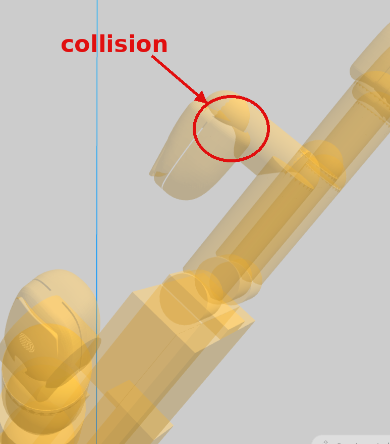
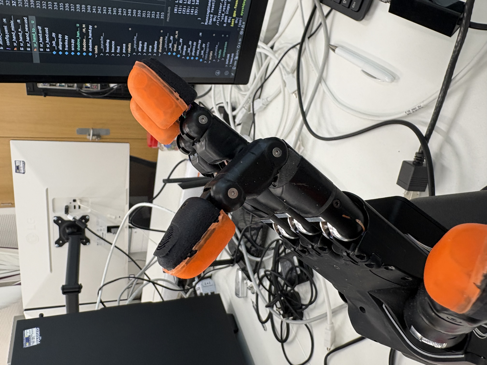

## 2026-06-05 — ShadowLite + TouchLab URDF, and chasing down the Baoding regression

**Tags:** #experiment #methods #results

### TouchLab fingers into the ShadowLite URDF

Built a new URDF for the ShadowLite hand today with the TouchLab tactile fingers
added in. Both the TouchLab fingertip and the PST finger show up in the model
now, sitting on the hand roughly where they should be.

*TouchLab fingertip in the ShadowLite URDF.*

*PST finger in the ShadowLite URDF.*

It's not actually confirmed to match our hardware yet though, and there are a few
things bugging me:

- Not sure this is even a good fit for the ShadowLite hand we physically have.
- The fingertip mesh and the body mesh are colliding. I need to work out under
  what poses that happens and then check whether it actually collides on the real
  hardware or if it's just a URDF artefact.
- Still need to verify the fingertip positioning against the physical hand.
- And cross-check the joint angles in the URDF against the hardware.

### Fixed the TouchLab fingertip collision

Closed off the fingertip/body mesh collision I flagged this morning. It turned out
to be a positioning issue rather than anything to do with the real hardware — the
TouchLab tip was sitting too low and poking straight into the joint/link mesh
(circled below).

*Before: the TouchLab tip mesh interpenetrating the link at the joint (circled).*

The fix was simple in the end — I added a small offset so the tip sits *above* the
joint, exactly the way the PST fingers do. With that, the interpenetration is gone.

*After: with the small offset the tip sits cleanly above the joint, like the PST fingers.*

That clears one of the open URDF items from this morning.

### Mimic URDF vs the real hand — they don't line up

Put the mimic URDF next to the real hardware today and there are clearly
discrepancies between the two.

The one thing I did manage to pin down: the mimic at 45° (FFJ2 — the equivalent of
FFJ0 in ROS) lands in the *same* pose as the hardware at 90°. So there's a
factor-of-two relationship between the mimic joint and the real coupled joint,
which more or less makes sense given how the coupling is supposed to work.

But even after accounting for that, watching the hardware and the URDF side by
side, the finger clearly isn't doing exactly what the model says it should — and
it's not subtle, it's a big discrepancy. The annoying part is this is the *same*
thing I saw earlier when I was quantifying the sim2real gap, so it's not a one-off
artefact.

*Mimic URDF in the joint viewer — driving FFJ2 (the FFJ0-equivalent) to compare against the hand.*

*The real ShadowLite hand (orange TouchLab fingertips) in the same configuration.*

**For now I'm not chasing the 90°/180° mismatch or the mimic joints not matching any
further. It shows up the same way across every seed, so it's a systematic, predictable
offset rather than something noisy or per-run — which means a single offset correction
should be enough to line the mimic up with the hardware. The thing actually worth
checking is the sim2real gap comparison of the joints across seeds: if the per-joint
gap stays consistent seed-to-seed, that confirms it's a fixed offset we can just
correct for rather than re-deriving the coupling. Not worth more time on it beyond
that right now.**

The cleaner way to actually close the sim↔hardware proprioception gap is to take the
mimic out of the URDF altogether. And it isn't just the URDF — the Shadow USD is wrong
in the same way: it implements the same mimic mechanism, but differently from how the
real hand does it. Since neither model reproduces the hardware coupling on its own, the
sensible place to handle it is at the environment level, where we can apply the correct
coupling consistently instead of trusting the URDF or the USD to get it right.

### Trying to figure out what killed the Baoding performance

We noticed something annoying. Two configs:

- **A** — mimic joints + fingertip-only tactile sensing → did *not* do Baoding in sim.
- **B** — no mimic joints + 17 binary contact points across the hand → *did* do Baoding.

Problem is those two differ in two things at once (the mimic joints *and* the
sensing setup), so I can't actually tell which one is responsible for the drop.

So I'm rerunning the old experiments to untangle it. Right now I've got the old
URDF going (no mimic joints, 17 contact points) to re-verify that the original
result still holds. Run's in progress.

Once this finishes I'll need a run that changes only *one* thing from the failing
config — otherwise I still won't know if it's the sensors or the mimic joints (or
the two interacting).